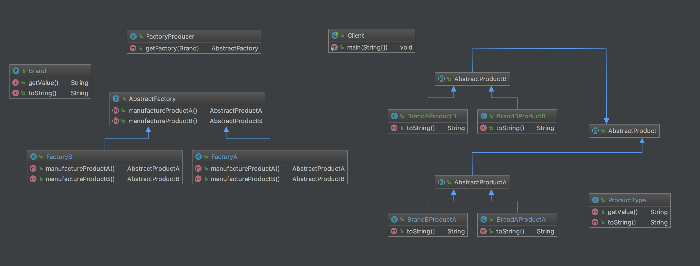

# Abstract Factory

Provide a level of indirection that abstracts the creation of families of related or dependent objects without directly specifying their concrete classes. 
The "factory" object has the responsibility for providing creation services for the different product with same brand. 
Clients never create product with same brand directly, they ask the factory to do that for them.

# Structure


# My example

Client can use FactoryProducer create Factory with specify brand, and then use factory create different type of product with same brand.



# Notes
- You don't necessarily need an AbstractProduct class for AbstractProductA and AbstractProductB.
- AbstractFactory and AbstractProduct can be either abstract class or interface.
- FactoryProducers can also be excluded in this pattern. I putx``` it there because I believe it will be easier to use by client with a producer.