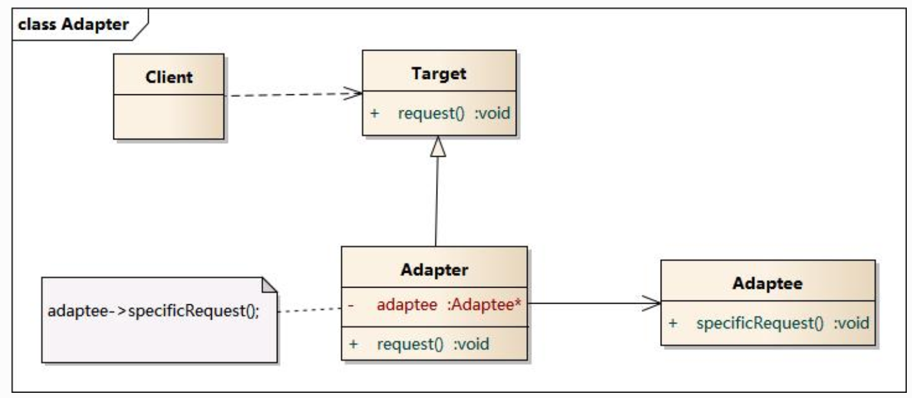

# Adapter
- Convert the interface of a class into another interface clients expect. Adapter lets classes work together that couldn't otherwise because of incompatible interfaces.
- Wrap an existing class with a new interface.
- Impedance match an old component to a new system

# Structure

# My example

# Notes
- Adapter can also named wrapper
- Adapter is a high level interface, for decouple systems rather than just class.