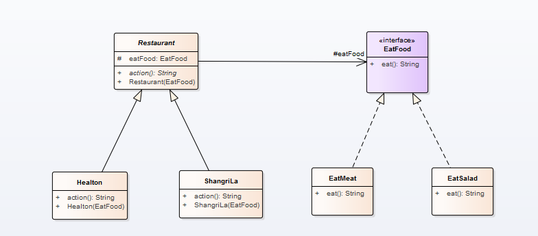

# Bridge pattern
Decouple an abstraction from its implementation so that the two can vary independently.

# Structure

# My example

# Note
- Restaurant can be either interface or abstract class 

# Reference
<https://www.imooc.com/article/24008>