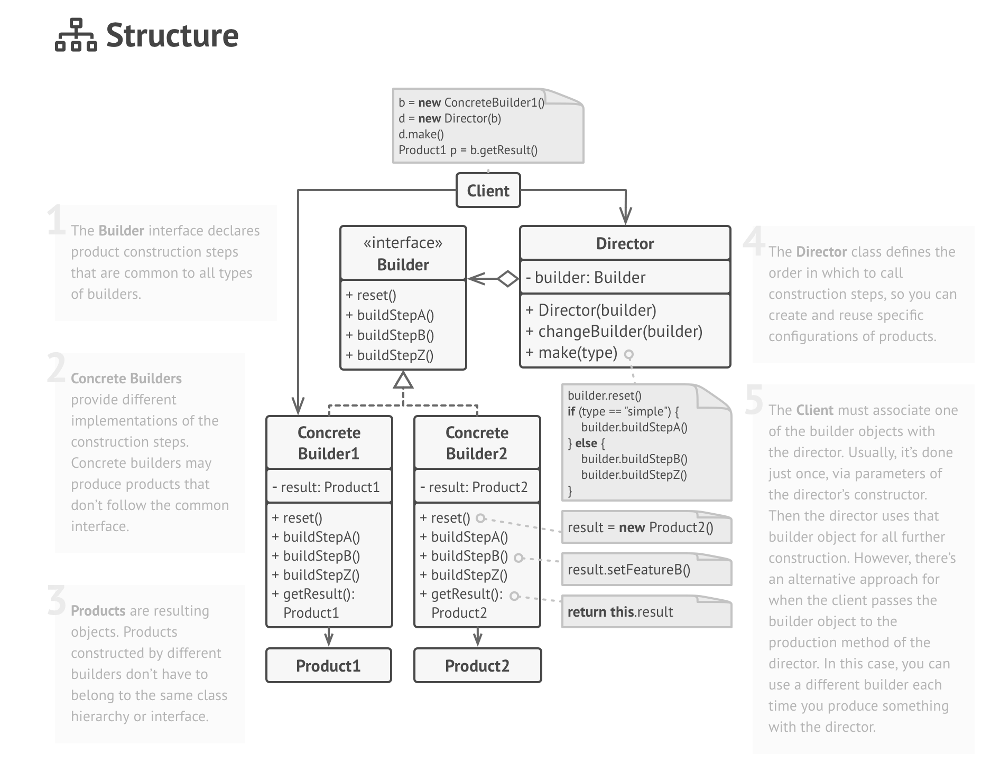
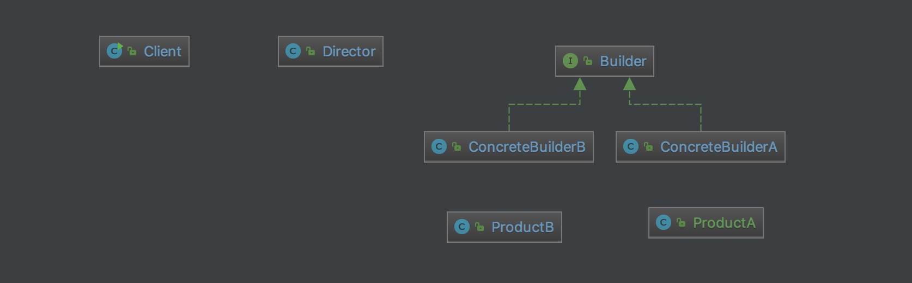

# Builder pattern
This pattern normally use to create elements of a complex aggregate, or build a complex product step by step.
There are two core role for build one product: director and concreteBuilder.
Director is response for deal the **PROCESS** of build product, concreteBuilder response for **HOW TO** build each single step of product. 
They decoupled by an interface normally named "Builder", so we can reuse director's process ability and builder's building ability.

# Structure

# My example

# Notes
- Builder can be either interface or abstract class
- If you don't have multi homogenization aggregates or complex product which can created with similar process, we can use single builder without director and interface. 

# Reference:
<https://refactoring.guru/design-patterns/builder>