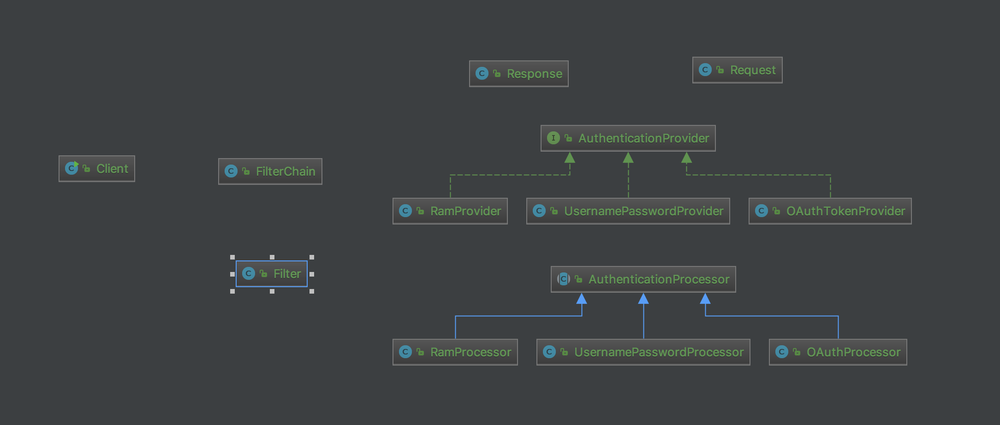

# Chain of responsibility
The pattern allows multiple objects to handle the request without coupling sender class to the concrete classes of the receivers. 
The chain can be composed dynamically at runtime with any handler that follows a standard handler interface.

# Structure

# My example

# Reference
<https://www.baeldung.com/chain-of-responsibility-pattern>