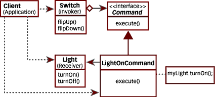
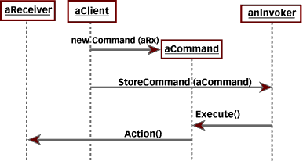
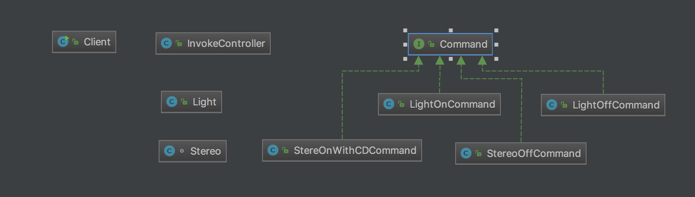

# Command
Command pattern is ami to use object to manage & re-use actions.

# Structure

# My example

# Note
- Need to issue requests to objects without knowing anything about the operation being requested or the receiver of the request.