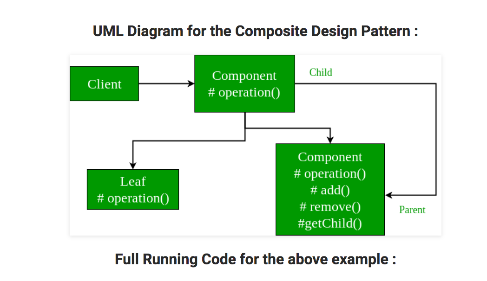

# Composite
Composite pattern is used when application needs to manipulate a hierarchical collection of "primitive" and "composite" objects. 
Processing of a primitive object is handled one way, and processing of a composite object is handled differently. 
Having to query the "type" of each object before attempting to process it is not desirable.

# Structure

# My example

# Note
- Recursive composition as tree structure

# Reference
<https://www.geeksforgeeks.org/composite-design-pattern/>