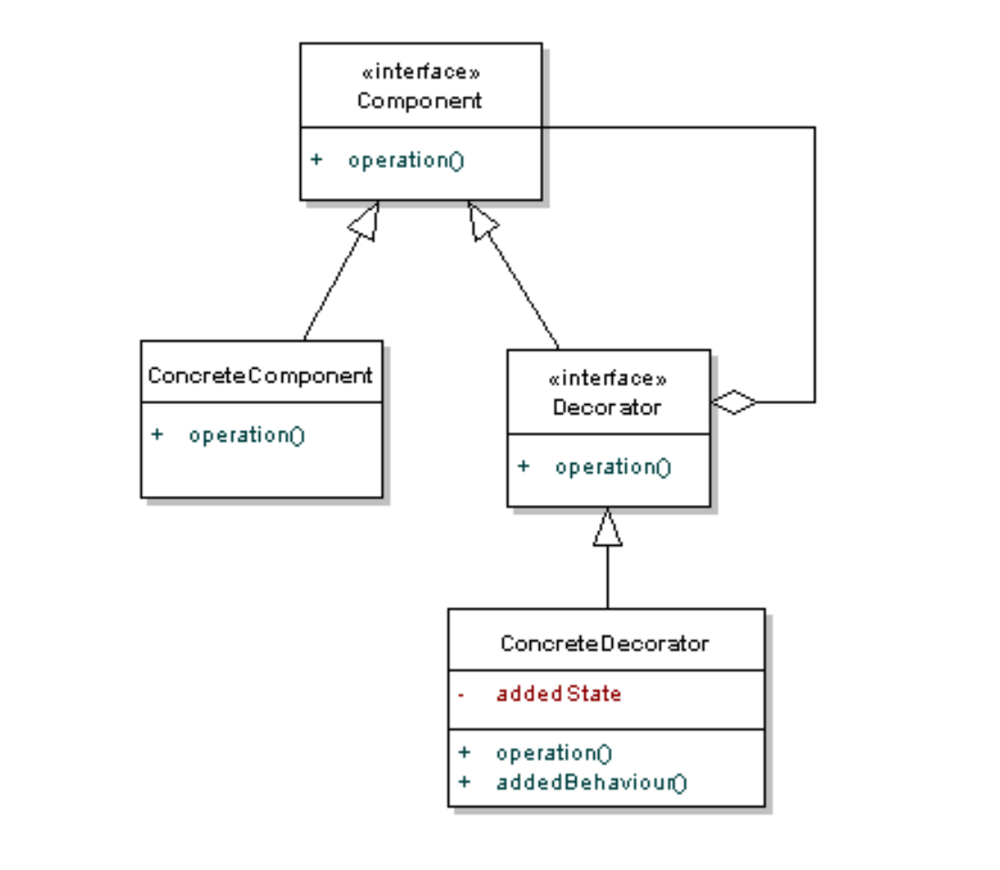
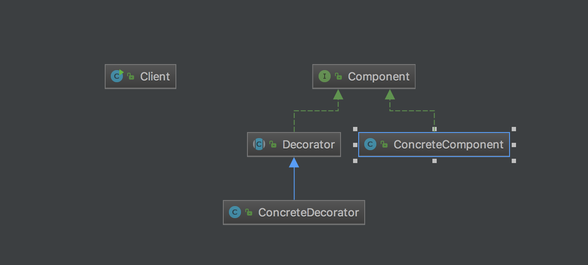

# Decorator
Decorator is used when you want to attach some additional features to an object dynamically.
Decorators provide a flexible alternative to subclassing for extending functionality.

# Structure

# My example 

# Note
- ConcreteDecorator can have different types.
- Decorator normally named Wrapper

# Reference
<https://www.cnblogs.com/octobershiner/archive/2011/11/04/2236730.html>