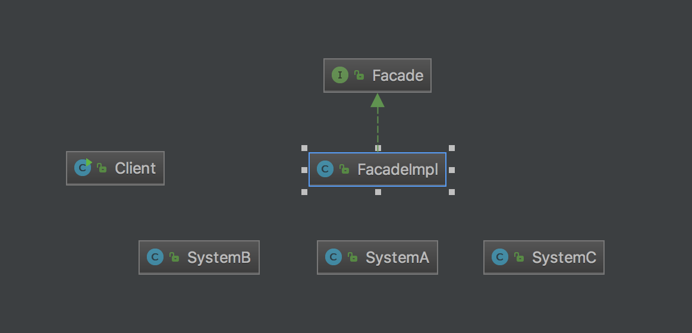

# Facade
Wrap a complicated subsystem with a simpler interface.

# Different between Adapter pattern
> "An Adapter is used when the wrapper must respect a particular interface and must support a polymorphic behavior. On the other hand, a facade is used when one wants an easier or simpler interface to work with."

# Structure

# My example

# Note
- Facade better be a light class to keep interface simple. 