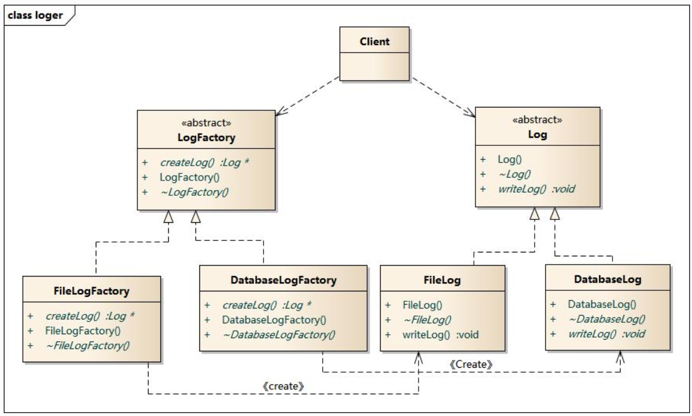
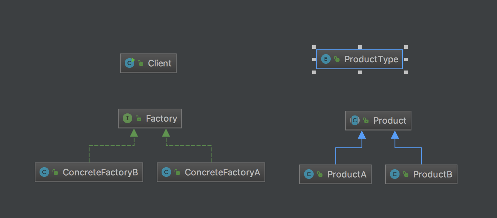

# Factory method
Define an interface for creating an object, but let subclasses decide which class to instantiate. 
Create concrete factory for specify product as subclasses for decoupling. Clients won't care about how to create or what has created before running.  
Decouple concrete product and factory by product interface.
Decouple concrete factory and client by factory interface.

# Structure

# My example
