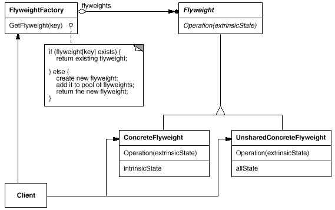
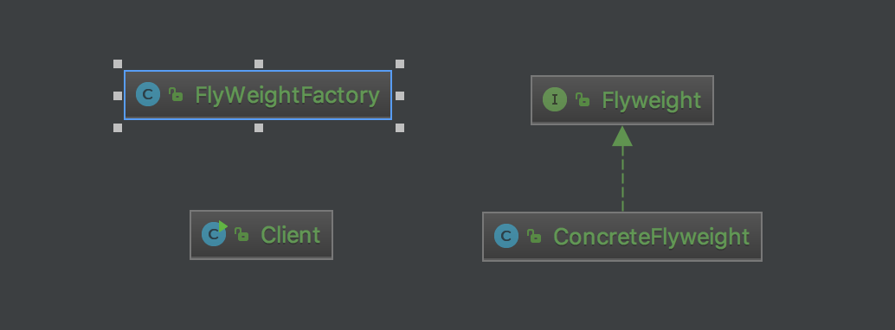

# Flyweight
In Flyweight pattern we use a HashMap that stores reference to the object which have already been created, every object is associated with a key. 
Now when a client wants to create an object, he simply has to pass a key associated with it and if the object has already been created we simply get the reference to that object else it creates a new object and then returns it reference to the client.

# Structure

# My example

# Note
- One important feature of flyweight objects is that they are immutable. This means that they cannot be modified once they have been constructed.
- Use sharing to support large numbers of fine-grained objects efficiently.

# Reference
<https://blog.csdn.net/u013256816/article/details/51009522>