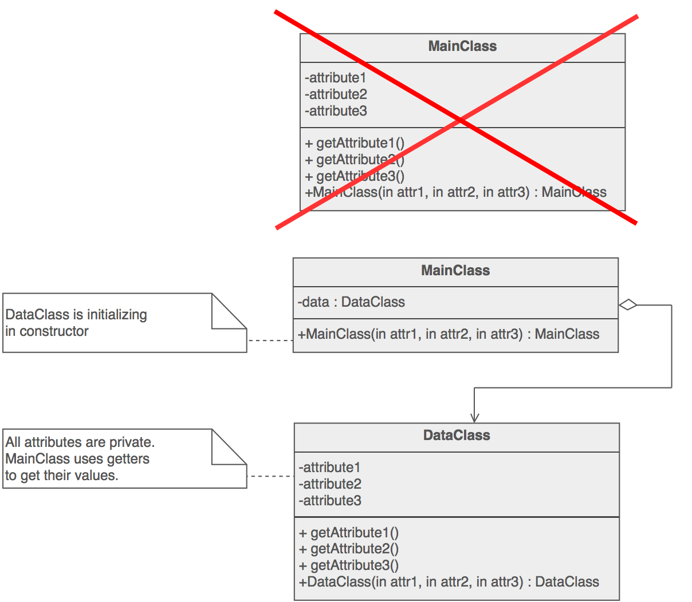
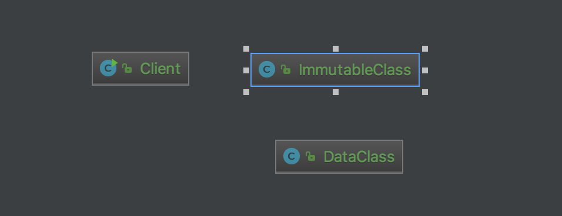

# Private class data
The private class data design pattern solves the problems above by extracting a data class for the target class and giving the target class instance an instance of the extracted data class

# Structure

# My example

# Note
- Control write access to class attributes
- Separate data from methods that use it
- Encapsulate class data initialization
- Providing new type of final - final after constructor

# Reference
<https://sourcemaking.com/design_patterns/private_class_data>