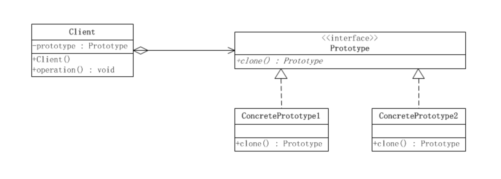
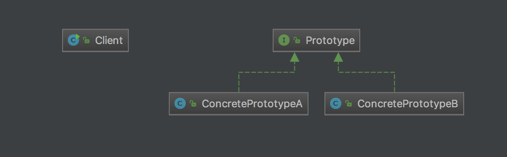

# ProtoType
Co-opt one instance of a class for use as a breeder of all future instances.

# Structure

# My example

# Notes
- Shallow clone is “default implementation” in Java which is ‘field by field copy’ as the Object class does not have idea about the structure of class on which clone() method will be invoked.
- Deep clone is the desired behavior in most the cases. In the deep copy, we create a clone which is independent of original object and making changes in the cloned object should not affect original object.
- Clone is much more efficient than new() because it's directly execute by binary, and because of that, clone won't call construction and also will ignore declaration of fields.

# Reference
<https://blog.csdn.net/zhengzhb/article/details/7393528>