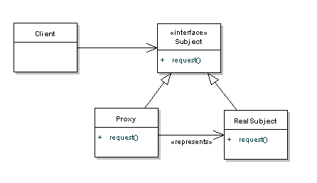
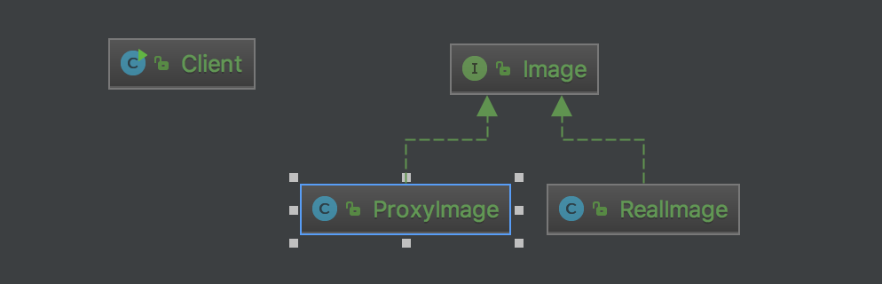

# Proxy pattern
Allows for object level access control by acting as a pass through entity or a placeholder object. 

# Structure

# My example

# Note
- Easy to inject process for all objects which proxied by a same proxy. just like spring.
- Lazy load. Instance only create when request coming, that's more reactive.

# Reference
<https://www.tutorialspoint.com/design_pattern/proxy_pattern.htm>